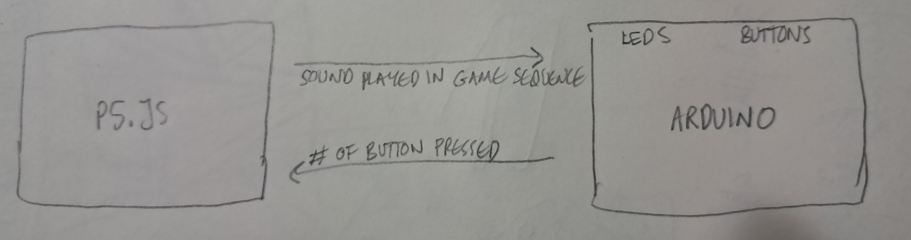
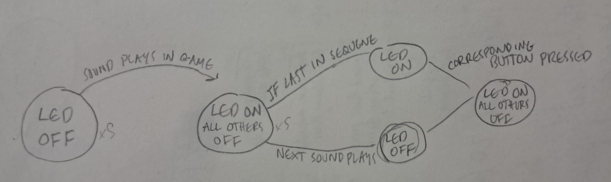
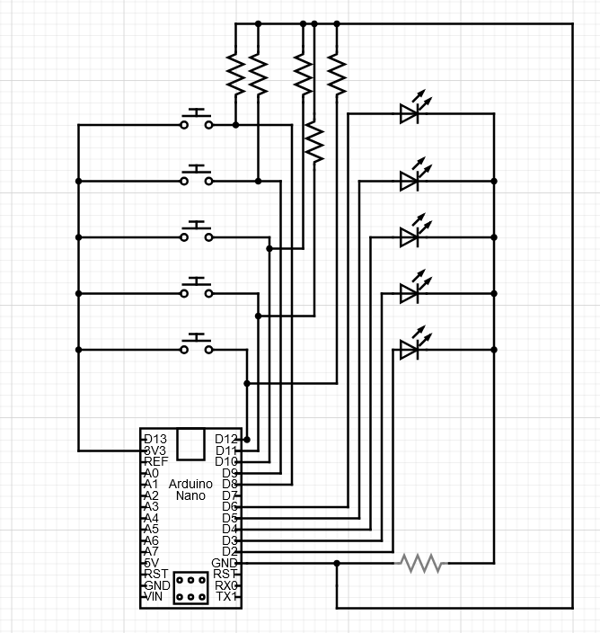
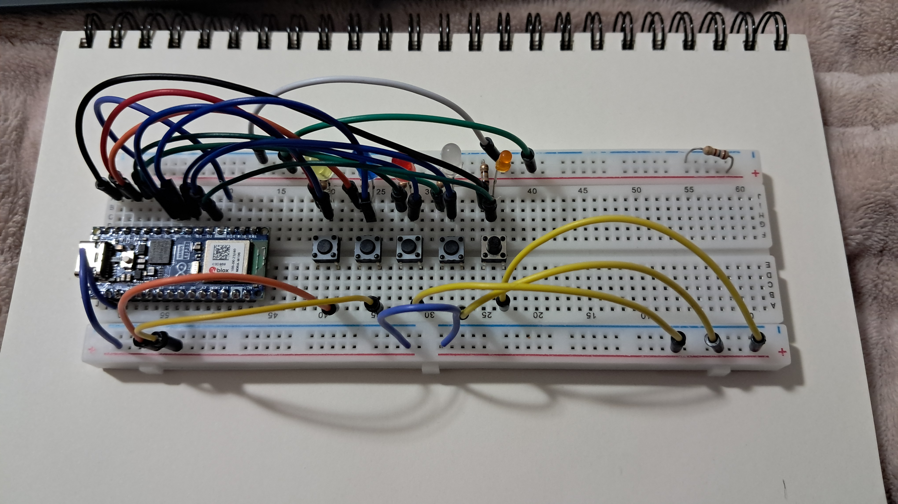
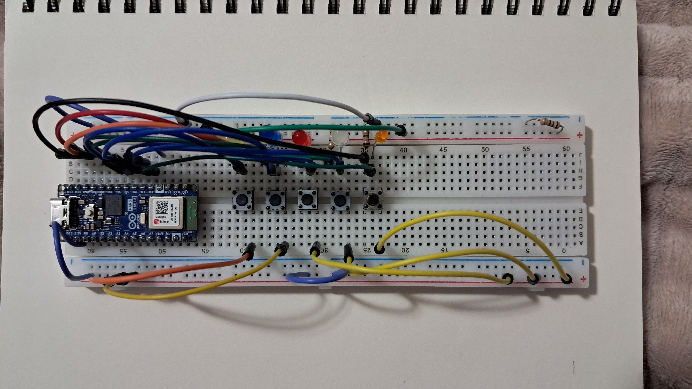
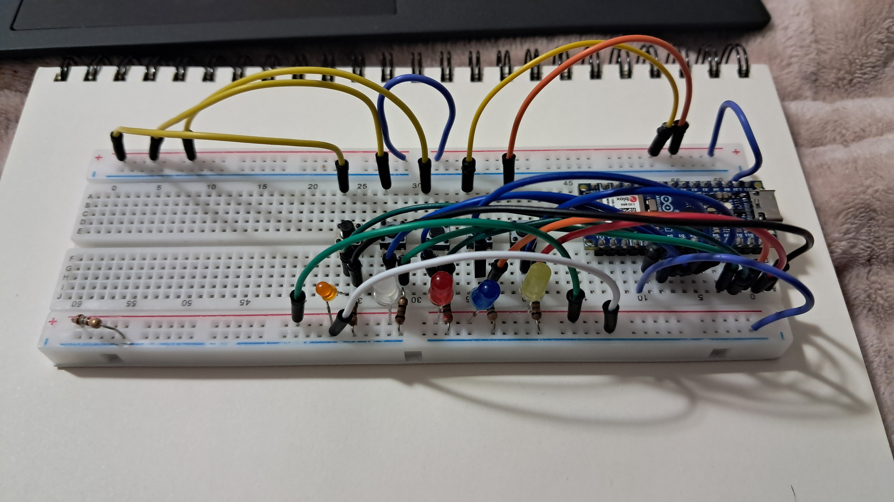

# MILESTONE ONE

## Idea 1

Something with buttons and sound - maybe a memory game type thing where the computer will play certain sounds, and buttons on the Arduino are also linked to sounds in p5.js and you have to recreate the sound patterns. Like the computer will generate random sound patterns that grow by 1 every time, and if the sound input returned by the Arduino matches what the computer did you get a point. Game just goes on forever until you fail, but keeps track of highest score.

## Idea 2

Is there some way to connect the Arduino to the radio with p5.js? 

## Idea 3

Morse code translator? Button on the Arduino and the computer gives a text output?

# MILESTONE TWO

For the sound game:

1. p5.js will give a series of notes that increase in number by one each "level". On the computer screen is also a point counter.
2. Each button on the Arduino will correspond to a note and each button has an accompanying light next to it (all different colors).
3. When a note plays in p5.js, the accompanying light on the respective Arduino button will light up, to help the user identify which button gives which notes
4. After p5.js has played its sequence of notes, the user has to return the same sequence of notes by pressing the respective buttons
5. When p5.js recognizes that the correct sequence has been played, the point counter on the computer screen will increase by one and p5.js will give a new sequence of notes, and repeat.
6. If the sequence of notes given back by the user does not match the original p5.js sequence, the game resets and the point counter resets to 0.

The Arduino components needed would be 5 buttons and 5 lights (and as many resistors and wires as needed).

The code for this (on the Arduino side) would, I imagine be similar to the password machine homework, but I need to figure out a way for it to recognize buttons pressed in specific sequences. Or perhaps that would be on the p5.js side, where the string of button presses is sent to p5.js.

I imagine for the sounds I will upload clips of notes in the basic scale. I will probably have to have some people play the game to make sure its visually easy to understand how to play, etc. 

# FINAL 

### SYSTEM DIAGRAM

### FSM DIAGRAM

### CIRCUIT DIAGRAM

My project obviously uses the p5 sound library, and I was going to use the JSON library for Arduino but it ended up not being necessary.

My project uses 5 buttons to send data to p5, each button corresponding triggering a sound to be played on the computer. I also have 5 LED lights that turn on when the buttons are pressed, or when the computer plays a sound sequence.

I decided to make this game because in class, I found myself most interested in the sound functions of p5 and the buttons in Arduino, and I was inspired by how many people made games during our midterm projects. The amount of components needed on my Arduino for this project (5 buttons, 5 LEDS, and a lot of wires), and the fact that the Arduino and p5 both need to be able to send and receive information meant that there was a lot of trial and error testing, and slowly making sure one component worked on its own before incorporating it into the full project.

Since I put the LEDs in last, I had to test the button and sound functions by printing the game sequence in the browser console and working off of that, which was helpful because I could also print the answer sequence and make sure each button was sending information correctly when pressed.

I added some instructions once I finished the project just to make it clear how each onscreen button worked to the user.

